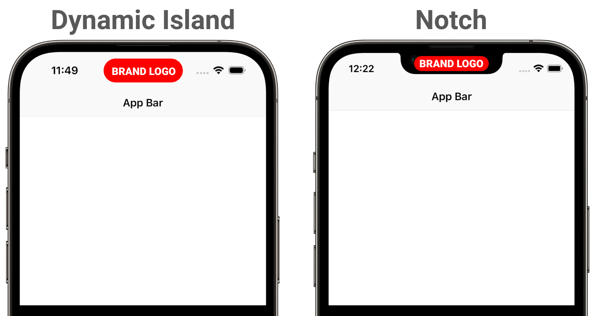

## Features

The **hidden_logo** package allows you to add any Flutter widget under the Notch or
the Dynamic Island for iPhones. It can be your brand logo or its simplified version.
They will only be visible for users in certain scenarios, for example when a user
takes a screenshot of your app, minimizes it or uses some kind of screen mirroring.



<p align="left">
<a href="https://pub.dev/packages/hidden_logo"></a>
<a href="https://github.com/AndreySosnovyy/hidden_logo"></a>
</p>

❗No additional checks or manually written conditions are required when using `HiddenLogo`:</br>

- **Application running on any other devices not marked as target ones will not be
  affected**. Currently, the list of target devices only contains all iPhones starting
  from iPhone X all the way up to iPhone 17 series. </br>
  You can see the [List of Target iPhones](#iphones-hardware-barrier-types-target-devices) separated by hardware barrier
  type (Notch or Dynamic Island) in the table down below.
- It provides **precise size constraints for every iPhone**. So you don't need to
  be worried about the size of your child widget.
- Corners of your Dynamic Island widget will be **rounded automatically**.
- Your child widget will only be visible in **portrait mode**.

## Usage

Wrap your `MaterialApp` or `CupertinoApp` with `HiddenLogo` widget or define
its `builder` function. Then you have to provide 2 builders for 2 cases:
iPhones with Notch and the ones with Dynamic Island.

```dart
@override
Widget build(BuildContext context) {
  return MaterialApp(
    builder: (context, child) {
      return HiddenLogo(
        body: child!,
        notchBuilder: (context, constraints) {
          return MyNotchLogoBuilder();
        },
        dynamicIslandBuilder: (context, constraints) {
          return MyDynamicIslandLogoBuilder();
        },
      );
    },
  );
}
```

The size of your brand logo can be adaptive thanks to constraints provided
by the widget. They define `maxWidth` and `maxHeight` where you can draw and remain hidden.<br>
All the existing iPhone variants starting from iPhone X are tested, so the widget
always returns correct max constraints!

Also do not forget to define the `BorderRadius` property for your Notch logo widget,
so it nicely fits under the hardware barrier and is non-visible when not intended to.</br>

## Additional information

### Recommendations and tips

❌ Do not place kinky visual trash (especially ads) but only your brand or
application logo. Doing the opposite may cause trouble with releasing
your app to the store.

❌ Do not place any important or sensitive information in the `HiddenLogo` widget.
Assume that users don't even see your widget there.

❌ Do not set any tap callbacks for your widgets that you place under
the hardware barriers. Users will not be able to click there.

❌ Do not use the `HiddenLogo` widget if the top of the screen in your app already
has many details in app bars. Doing the opposite will make it look even more overloaded.

✅ Hide your HiddenLogo widget while the splashscreen is displayed. You can achieve this
by setting the `isVisible` property to `false` in the `HiddenLogo` widget.

✅ Set the `visibilityMode` of your logo to **only visible in background** if you
want to hide it for screenshots. But it will still be visible when the app is minimized.

✅ If your brand's logo is complicated and has many small details you may want to
use a simplified version. Or just display its name.

✅ Feel free to slightly animate your child widget if needed. But don't overdo it!

### Debugging

To test visual appearance of your widget when developing you can either
minimize your app or take a screenshot of your app (for ios simulator:
Device → Trigger Screenshot)

### iPhones hardware barrier types (Target devices)

| Notch      | Dynamic Island |
|:-----------|:---------------|
| X          | 14 Pro         |
| XR         | 14 Pro Max     |
| XS         | 15             |
| XS Max     | 15 Plus        |
| 11         | 15 Pro         |
| 11 Pro     | 15 Pro Max     |
| 11 Pro Max | 16             |
| 12         | 16 Plus        |
| 12 Mini    | 16 Pro         |
| 12 Pro     | 16 Pro Max     |
| 12 Pro Max | 17             |
| 13         | Air            |
| 13 Mini    | 17 Pro         |
| 13 Pro     | 17 Pro Max     |
| 13 Pro Max |                |
| 14         |                |
| 14 Plus    |                |
| 16e        |                |

## About new devices support

When the new iPhones are released, your logos won't appear on their screens because
the actual shape and size configuration of further devices are unknown in advance.
But the package will be updated as soon as possible when all necessary SDKs are available!

### Contribute 🛠

You can also contribute to this package on [GitHub](https://github.com/AndreySosnovyy/hidden_logo). </br>
Suggest your ideas or bug reports by opening an [issue](https://github.com/AndreySosnovyy/hidden_logo/issues/new) or
creating a [pull request](https://github.com/AndreySosnovyy/hidden_logo/pulls).
</br>
</br>
</br>

